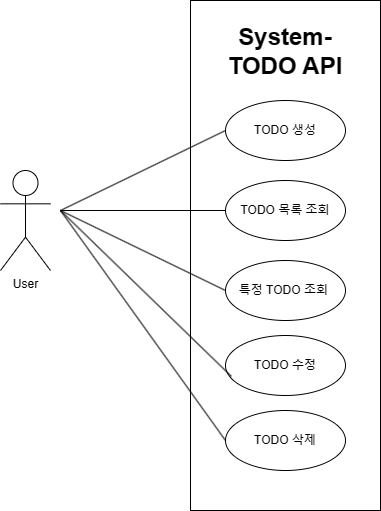
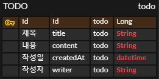
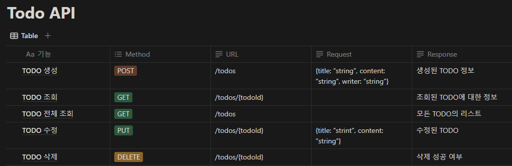

# Todo API

## 개요

간단한 Todo API입니다. Todo 생성, 수정, 삭제, 전체 목록 조회, 특정 Todo 조회를 지원합니다.

## Use-Case Diagram

## Entity Relationship Diagram

## API specification

http://localhost:8080/swagger-ui/index.html#

## Environment

- JDK: temurin 21.0.3
- Kotlin: 1.9.23
- Spring Boot: 3.2.5
- IDE: IntelliJ IDEA 2024.1
