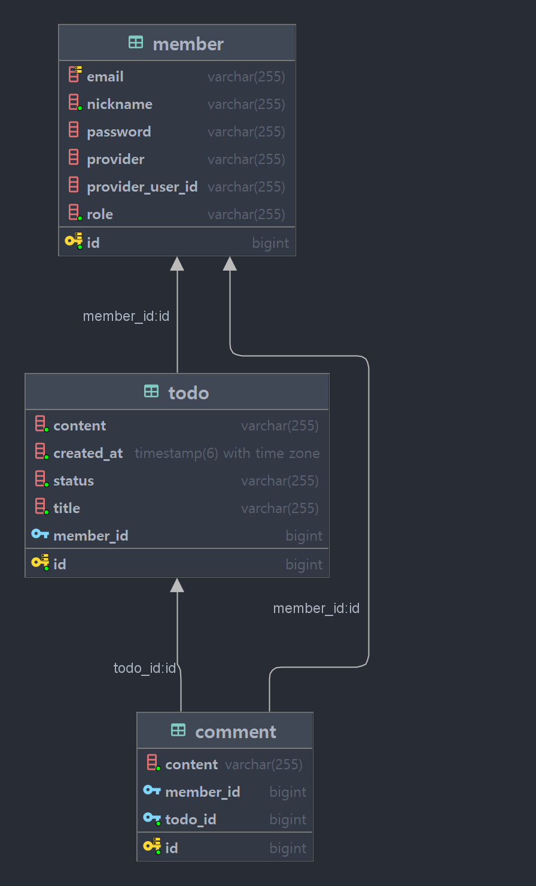

# Todo API

## 개요

간단한 Todo API입니다.

- sign-up api 통해 회원 가입 후, sign-in api를 통해 토큰을 발급받거나 oauth2/{provider}/login api를
  통해 토큰을 발급 받습니다. 현재 Naver 소셜 로그인만 지원하고 있습니다.
- Get method에 대한 api는 토큰 없이 사용할 수 있습니다.
- authorization header에
  토큰을 명시하여 다른 api들을 사용할 수 있습니다.
- 본인의 Todo, Comment만 수정, 삭제할 수 있습니다.
- 지원하는 기능
    - Todo 생성, 수정, 삭제, 전체 목록 조회, 특정 Todo 조회, 상태 변경
    - Comment 생성, 수정, 삭제
    - sign-up, sign-in
    - social login(현재 naver만 지원)

[//]: # (## Use-Case Diagram)

[//]: # (

)

## Entity Relationship Diagram

## API specification

https://lace-william-4d4.notion.site/6645714a178a4265817486497e508396?v=1fccf03ee7bf470d8f978f5f02d746e4&pvs=25
http://localhost:8080/swagger-ui/index.html#

## Environment

- JDK: temurin 21.0.3
- Kotlin: 1.9.23
- Spring Boot: 3.2.5
- IDE: IntelliJ IDEA 2024.1
- jjwt: 0.12.5
- DB: postgresql
